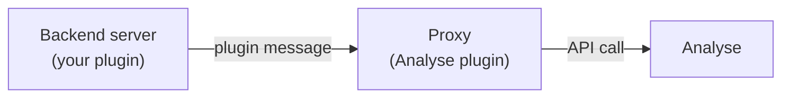

# Plugin messaging

If you run a network with backend game servers behind a Velocity or BungeeCord proxy, and the Analyse plugin is installed only on the proxy, the SDK has a helper for sending events from a backend up through the proxy.

This is how you get custom events from a backend server when that backend can't talk to the Analyse API directly.

## The idea



Your plugin on the backend serializes an event into a plugin message and sends it through the proxy using `player.sendPluginMessage`. The Analyse plugin on the proxy receives it and forwards it to the Analyse API.

## Sending an event

```java
import net.analyse.api.messaging.AnalyseMessaging;

byte[] message = AnalyseMessaging.event("crate_opened")
    .withPlayer(player.getUniqueId(), player.getName())
    .withData("crate_type", "legendary")
    .withValue(100.0)
    .build();

player.sendPluginMessage(plugin, AnalyseMessaging.CHANNEL, message);
```

## Register the outgoing channel

Your backend plugin needs to register the channel once, typically in `onEnable`:

```java
@Override
public void onEnable() {
    getServer().getMessenger().registerOutgoingPluginChannel(
        this,
        AnalyseMessaging.CHANNEL
    );
}
```

The proxy registers the incoming side automatically when the Analyse plugin loads.

## Tracking an A/B conversion

```java
byte[] message = AnalyseMessaging.createConversionMessage(
    player.getUniqueId(),
    player.getName(),
    "new-spawn",
    "first_purchase"
);

player.sendPluginMessage(plugin, AnalyseMessaging.CHANNEL, message);
```

> [!NOTE]
> The backend cannot read A/B test variants through this channel. Variants are sticky per player, so the usual pattern is: run the A/B test on the proxy (or on a backend where Analyse is installed), and let the backend only send the conversion.

## What you need

- Analyse plugin installed on your proxy (Velocity or BungeeCord).
- `analyse-api` added as a `compileOnly` dependency on the backend &mdash; see [SDK installation](README.md#installation).
- The `analyse:events` channel registered on both ends (the proxy registers it automatically).

## When to use this vs a direct API key

- **Plugin messaging** works well when the backend should NOT have its own API key. One Analyse Server, one proxy.
- **A direct API key and the normal SDK** is the recommended setup. Give each backend its own Analyse Server. You get the richest data and the fewest moving parts.

## Low-level API

If you'd rather build the bytes yourself:

```java
byte[] message = AnalyseMessaging.createEventMessage(
    "crate_opened",
    player.getUniqueId(),
    player.getName(),
    Map.of("crate_type", "legendary"),
    100.0
);

player.sendPluginMessage(plugin, AnalyseMessaging.CHANNEL, message);
```

## Related

- [Custom events](events.md)
- [Reference](reference.md)
